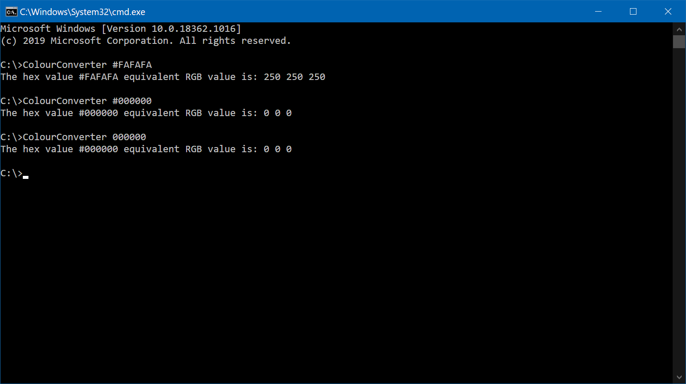
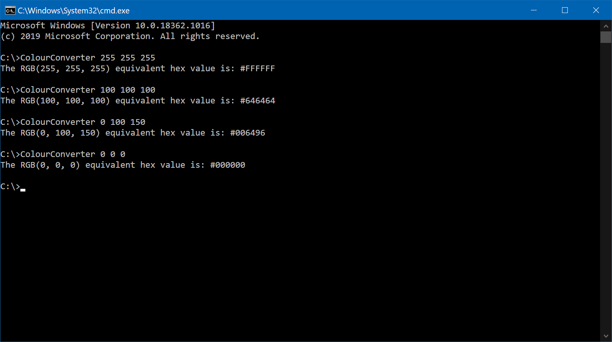
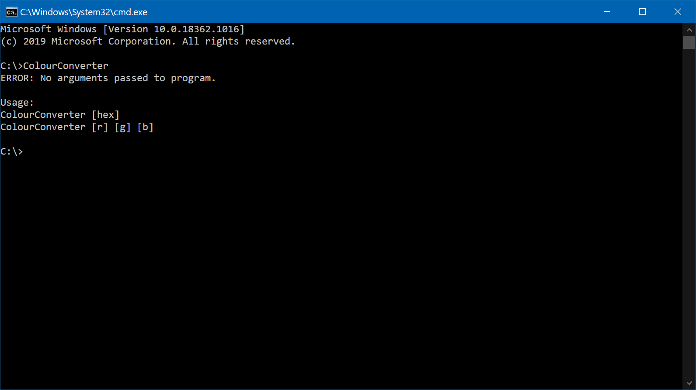

# Colour-Converter
A console application made in C++ to convert hex colours to their RGB equivalent and vice versa.

## How To Use:
```
ColourConverter.exe [HEX_VALUE]
```
```
ColourConverter.exe [R] [G] [B]
```

## Screenshots



